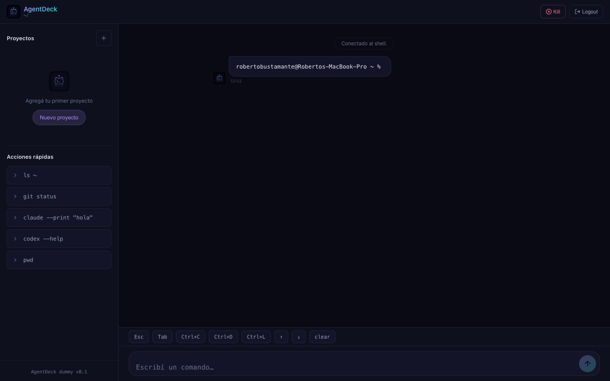
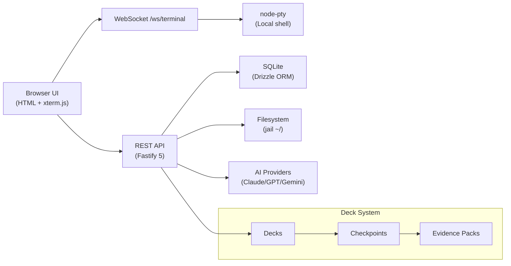

# AgentDeck — Centro de Mando Inteligente



**AgentDeck** es un centro de mando local para desarrolladores. Combina una terminal embebida con WebSocket hacia shell local, gestión visual de proyectos (Decks), checkpoints, un puente de contexto para asistentes IA, y acciones guiadas — todo desde el navegador.

Corre en tu máquina y se accede desde cualquier dispositivo en la misma red (iPhone, iPad, otra laptop) vía navegador. Sin cloud, sin suscripción, sin telemetría forzada.

> Proyecto de [virela-dev](https://virela.net/universo). Código abierto bajo AGPLv3. Developer preview — esperá cambios y bordes filosos.

## Status

**Developer Preview — Alpha.** El proyecto está en desarrollo activo. Las APIs, estructura de datos y flujos pueden cambiar sin aviso. No recomendado para uso productivo crítico.

## Why AgentDeck?

Los desarrolladores operan con múltiples herramientas: terminal, asistentes IA (Claude Code, Codex CLI, OpenClaw), gestores de proyectos, logs, scripts, checkpoints de estado. Cada una vive en su propia ventana, con su propio contexto, sin comunicación entre sí.

AgentDeck busca ser una **capa de integración local**: un dashboard que unifica el shell, los proyectos activos, el historial de comandos, los prompts a asistentes IA, y un sistema de snapshots (checkpoints) para capturar y restaurar estado de trabajo.

No reemplaza tu editor ni tu terminal. Las centraliza y las hace accesibles desde cualquier dispositivo en tu red.

## Features

| Feature | Estado |
|---|---|
| Terminal embebida con xterm.js + WebSocket | ✅ Estable |
| Sesión shell local persistente (node-pty) | ✅ Estable |
| Reconexión automática con grace period | ✅ Estable |
| Gestión de proyectos / Decks | ✅ Estable |
| Checkpoints con snapshots de estado | ✅ Experimental |
| Prompt bridge para contexto IA | ✅ Experimental |
| Acciones sugeridas contextuales | ✅ Experimental |
| Dashboard responsive mobile-first | ✅ Estable |
| Navegador de archivos con jail | ✅ Estable |
| Clasificador de riesgo de comandos | ✅ Estable |
| Historial de comandos con sugerencias | ✅ Estable |
| Configuración de proveedores IA (Anthropic, OpenAI, Google, OpenRouter) | ✅ Estable |
| mDNS local (`agentdeck.local`) | ✅ Estable |
| Workspace sincronizable via iCloud | ✅ Estable |

## Screenshots

```
docs/assets/screenshot-dashboard.png   — Vista principal con sidebar y terminal
docs/assets/screenshot-terminal.png    — Terminal embebida con atajos
docs/assets/screenshot-mobile.png      — Dashboard enviewport móvil
```

> **TODO**: Agregar screenshots reales antes de publicación. Crear `docs/assets/` y colocar las imágenes ahí.

## Architecture at a glance



## Requirements

- **Node.js** >= 22
- **npm** (package-lock.json incluido)
- **Sistema operativo**: macOS (probado), Linux (esperado, no verificado)
- **Navegador moderno**: Chrome, Firefox, Safari, Edge
- **Shell local**: bash, zsh, o compatible
- **Compilador C++**: necesario para `@lydell/node-pty` (Xcode Command Line Tools en macOS, `build-essential` en Linux)

## Quick start

```bash
git clone <repo-url>
cd agentdeck

# Opción 1: setup automático (recomendado)
npm run setup
npm run start

# Opción 2: manual
cd agentdeck
npm install
cp .env.example .env
npm run dev
```

Abrí en tu navegador:

- `http://127.0.0.1:8787` (local)
- `http://agentdeck.local:8787` (LAN, requiere `AGENTDECK_ALLOW_LAN=true`)

Passphrase por defecto: `agentdeck-dummy`. Cambiala editando `.env`.

## Project structure

```
├── LICENSE                 → AGPL-3.0-or-later
├── NOTICE                  → Copyright y marca
├── TRADEMARKS.md           → Política de marca AgentDeck
├── CONTRIBUTING.md         → Cómo contribuir (DCO + AGPL)
├── SECURITY.md             → Reporte de vulnerabilidades
├── CODE_OF_CONDUCT.md      → Código de conducta
├── DCO.txt                 → Developer Certificate of Origin
├── .env.example            → Variables de entorno de ejemplo
│
├── agentdeck/              → Aplicación principal
│   ├── package.json
│   ├── server.ts           → Entry point (Fastify + WS + routes)
│   ├── public/             → Frontend estático (index, login, settings)
│   ├── src/
│   │   ├── db/             → Drizzle schema + SQLite
│   │   ├── deck.ts         → Deck model, health, checkpoints
│   │   ├── fs-browse.ts    → Filesystem browser (con jail)
│   │   ├── guardrails.ts   → Clasificador de riesgo de comandos
│   │   └── routes/         → API routes
│   ├── scripts/            → Setup, doctor, update, reset
│   ├── AGENTS.md           → Contexto para asistentes IA
│   └── data/               → SQLite local (no versionado)
│
├── docs/
│   ├── licensing.md        → Modelo open core Community/Pro
│   ├── release-checklist.md
│   └── assets/             → Screenshots
│
└── README.md               → Este archivo
```

## Commands

| Comando | Descripción |
|---|---|
| `npm run dev` | Desarrollo con hot reload (tsx watch) |
| `npm run start` | Producción |
| `npm run doctor` | Diagnosticar entorno local |
| `npm run setup` | Setup completo + detección de workspace |
| `npm run update` | Post-git-pull (deps + doctor) |
| `npm run reset-local` | Reparar configuración local (seguro) |
| `npm run reset-local -- --all` | Limpiar datos locales (providers, uploads, data) |
| `npm run rebuild` | Recompilar node-pty nativo |
| `npm test` | Correr tests (guardrails) |

## Architecture

### Almacenamiento

AgentDeck separa tres espacios:

| Espacio | Ruta | Contenido |
|---|---|---|
| App | `agentdeck/` | Código fuente (versionado) |
| Home | `~/.agentdeck/` | API keys, uploads, DB local (no versionado) |
| Workspace | `iCloud Drive/AgentDeck` o `~/.agentdeck/workspace/` | Decks, recetas, prompts, checkpoints (sincronizable) |

### Seguridad

- Puerto 8787, host `127.0.0.1` por defecto (solo localhost).
- Autenticación por passphrase + cookie de sesión (`secure: !ALLOW_LAN`).
- Las API keys de proveedores IA se guardan en `~/.agentdeck/providers/` (local, no compartidas).
- Rate limiting en WebSocket: 60 mensajes/segundo por socket.
- Navegación de archivos con jail: solo permite acceder a `$HOME`.
- Clasificador de riesgo de comandos (guardrails) para detectar operaciones peligrosas.
- El workspace sincronizable (iCloud) no contiene credenciales ni tokens.

## License

**AgentDeck Community Edition** se distribuye bajo **GNU Affero General Public License v3 o posterior** (AGPL-3.0-or-later).

Esto significa que podés usar, estudiar, modificar y distribuir el software, pero **si ofrecés una versión modificada como servicio a usuarios por red, debés poner a disposición el código fuente correspondiente** bajo la misma licencia.

> El nombre "AgentDeck", el logo y la identidad visual **no** están cubiertos por AGPL. Consultá [TRADEMARKS.md](TRADEMARKS.md) para la política de marca.

Podrían existir licencias comerciales futuras para uso enterprise, hosting o propietario. Ver [docs/licensing.md](docs/licensing.md) para entender la separación entre Community Edition y futuros módulos comerciales.

## Links

- [Universo virela](https://virela.net/universo) — proyectos, notas y contexto del autor
- [Reportar bug](https://github.com/bus-eng/agentdeck/issues) — GitHub Issues
- [Reportar vulnerabilidad](SECURITY.md) — No uses issues públicos para seguridad

---

© 2026 Roberto Bustamante (virela-dev). Algunos derechos reservados.
